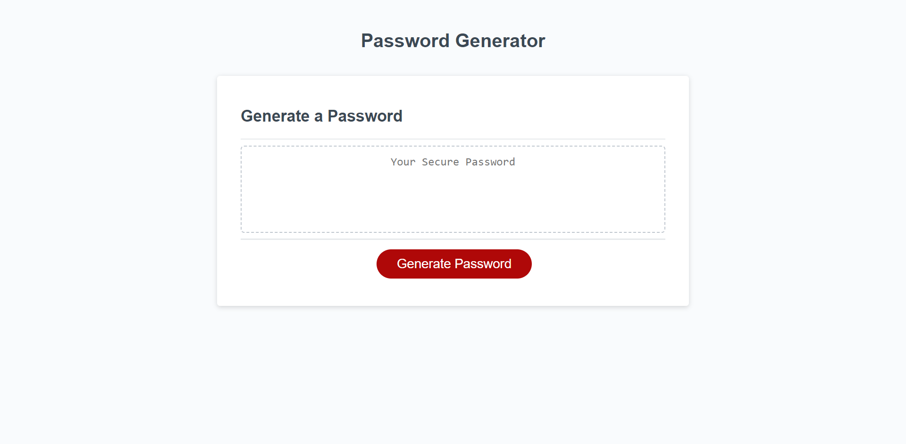

# Password Generator 

## Description

My motivation for completing this project, was to challenge myself in JavaScript. I built this in order to teach myself new JavaScript commands and as an easy way to keep people secure. People often have trouble coming up with secure passwords, this device will do all the thinking for you. I learned about concat commands and empty arrays on this project. 

## Installation

N/A

## Usage
To use, simply click on the generate password button, type in the number of characters you would like it to be, and answer the following questions. Note, that if you enter in an erroneous number, nothing at all, or answer all questions with "no". You will be met with an "unable to generate password" message. If this happens, simply click on the generate password button again.

  

## Credits
N/A

## License
N/A
